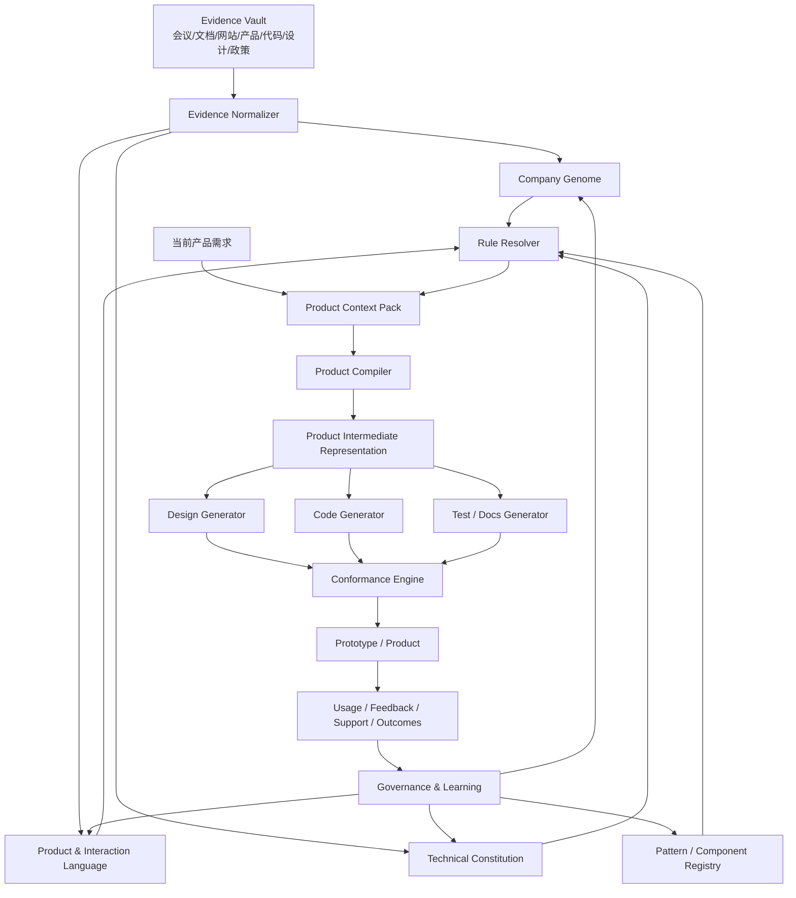

# Company Product OS
## Agent 时代的“公司原生产品生成操作系统”——概念、架构与实施蓝图 v0.1

> 核心命题：**让 Agent 不只是会开发软件，而是会“像这家公司一样做产品”。**
>
> Company Product OS 把一家公司的本体、价值观、文化、产品哲学、交互习惯、设计语言、技术理念和长期积累的模式，转化为 **可读取、可继承、可执行、可验证、可演进** 的机器资产。以后生成新产品时，不再重复解释“按钮怎么做、权限怎么做、语气怎么写、架构怎么选”，而是只描述新的用户问题与创新目标；稳定的公司级决策由系统自动继承。

---

# 0. 执行摘要

软件开发正在快速从“实现稀缺”进入“实现便宜、判断稀缺”的阶段。

受控实验中，GitHub Copilot 使用组在一个特定 JavaScript HTTP Server 任务上比对照组完成得快 55.8%；Google DORA 2025 基于近 5,000 名技术从业者的调查，将 AI 描述为组织能力的“放大器”——强组织会被放大，混乱组织的混乱也会被放大。另一方面，Figma 的设计系统实验显示，当设计系统与任务直接相关且保持最新时，参与者完成目标快 34%。这些结果的适用范围不同，不能简单外推为统一生产率，但它们共同指向一个变化：**当生成能力不断提高，组织内部长期稳定的产品判断、统一语言、复用模式和验证机制会变得更重要。**

这份蓝图提出一个新层级：

```text
客户/员工的真实需求
        ↓
Company Product OS
        ↓
公司原生 Product Context Pack
        ↓
Agent / Product Compiler
        ↓
设计 + 代码 + 文档 + 测试
        ↓
Conformance Engine
        ↓
“像这家公司做出来的”新产品
```

它不是一个超长 Prompt，也不等同于 Design System。

Design System 通常解决“怎么画、怎么组合组件”；Company Product OS 还要解决：

- 这家公司是谁；
- 为什么这样做；
- 用户应该获得什么感受和控制权；
- 相同动作在所有产品里意味着什么；
- 哪些技术和安全选择默认成立；
- 哪些规则必须遵守、哪些只是默认、哪些区域应鼓励创新；
- Agent 生成完后如何自动证明“它符合这家公司”。

最重要的客户交付场景是：

> **客户会议录音 + 客户产品/品牌/技术资料 + 现有产品证据 → Company Genome → Product Brief → 公司原生产品 → 自动一致性评估 → 客户员工直接上手 → 被验证的新模式反向进入 Company Product OS。**

会议不是最终 Prompt，而是 **Evidence（证据）**。  
Company Product OS 不是“训练一个模型记住客户”，而是建立一个 **可审计的公司级执行层**。

---

# 1. 为什么现在需要这一层

## 1.1 Agent 让“做出一个产品”越来越容易

AI 编程已经能显著压缩部分实现工作。Peng 等人的 GitHub Copilot 受控实验中，处理特定 JavaScript HTTP Server 任务的 Copilot 组比对照组快 55.8%。

但“代码更快”不等于“产品更好”。

当一家企业同时让几十个 Agent 生成：

- CRM；
- 内部审批系统；
- 数据看板；
- 移动端工具；
- AI 助手；
- 客服后台；
- 供应链工具；

如果没有一个上层系统，Agent 会不断重新做决定：

- 导航应该在左还是上；
- 删除是直接执行还是二次确认；
- 表格怎么筛选；
- 状态颜色是什么意思；
- “完成 / 提交 / 保存 / 应用”分别什么时候用；
- 错误如何表达；
- AI 能不能自动替用户执行；
- 什么数据能上传云；
- 权限继承关系是什么；
- API、日志、审计、监控怎么处理。

于是会出现一个新的问题：

> **代码熵下降，产品熵上升。**

## 1.2 企业会从“开发瓶颈”转向“产品一致性瓶颈”

如果每个 Agent 都拥有强生成能力，却没有统一的公司级产品逻辑，公司可能一天生成十个产品，但这十个产品：

- 像十家公司做的；
- 用户每个都要重新学；
- 产品经理仍然逐页扣细节；
- 设计团队变成“Agent 输出修复团队”；
- 技术团队继续重复做权限、日志、错误处理；
- 价值观写在官网，实际产品行为却不体现；
- 每次项目都重新争论过去已经解决的问题。

这就是 Company Product OS 要解决的主要矛盾。

## 1.3 一致性不是美术问题，而是认知成本问题

Apple 2026 Human Interface Guidelines 的“Familiarity”原则明确强调：

- 建立在用户已经理解的概念之上；
- 视觉和交互一旦建立，应保持一致；
- 一致性帮助用户更快学习，并相信新交互会按预期工作。

IBM Carbon 更直接把共享基础与业务结果连接起来：同一基础上的产品体验可以降低认知负担、用户错误、培训和支持需求，让已经学会的知识跨产品迁移。

IBM Cloud 的 Carbon 10 / Cloud PAL 案例尤其值得参考：

- 22 个 Cloud patterns 覆盖约 90% Cloud UI；
- 案例报告称采用规范的区域支持工单降低 18%；
- IBM Cloud 估算每个复用 pattern 为设计和开发团队节省约 2,000 小时；
- 同时设置明确的 Priority 1/2/3 审核与 exemption（例外）机制。

这些是特定公司、特定迁移项目的案例数据，不能直接当作普遍 ROI，但它说明一个关键事实：

> **把“常见问题的最佳答案”变成组织共享基础，能同时影响开发效率、用户学习、支持成本和品牌一致性。**

Company Product OS 就是在这个方向上，把传统 Design System 再向上扩一层。

---

# 2. 一句话定义与类别边界

## 2.1 一句话定义

**Company Product OS 是一家公司的可执行产品本体：它把公司长期稳定的身份、价值观、产品原则、交互语义、设计语言、技术理念和已验证模式编译为 Agent 可继承和可验证的生产基础。**

## 2.2 三个核心模块

### A. Company Genome — 公司基因

回答：

> **“我们是谁，以及我们通常如何判断。”**

包含：

- 本体 / Identity；
- 公司使命与愿景；
- 价值观；
- 企业文化；
- 用户观；
- 产品哲学；
- 人机关系；
- 品牌性格；
- 隐私、安全、透明、可恢复等原则；
- 组织长期不轻易改变的判断方式。

### B. Product Compiler — 产品编译器

回答：

> **“面对这次具体需求，这家公司应该造出什么？”**

输入：

- 产品意图；
- 用户/岗位；
- 客户会议；
- 业务约束；
- Company Genome；
- 适用的技术/设计/交互规则；
- 现有组件和模式。

输出：

- 产品规格；
- 信息架构；
- 用户流程；
- UI；
- API/数据结构；
- 代码；
- 测试；
- 文档；
- 部署策略。

### C. Conformance Engine — 一致性引擎

回答：

> **“这个新产品真的符合这家公司吗？”**

验证：

- 品牌一致性；
- 交互语义；
- Design Token；
- 组件复用；
- 文案语言；
- Accessibility；
- 技术架构；
- API 规范；
- 权限；
- 安全；
- 隐私；
- 可观测性；
- 审计；
- 必须规则；
- 合法例外。

---

# 3. 它和现有体系有什么不同

| 体系 | 主要回答 | 缺口 |
|---|---|---|
| Brand Guide | “我们看起来/说起来像谁？” | 通常不决定真实产品行为 |
| Design System | “UI、组件、Pattern 怎么做？” | 很少覆盖战略、本体、技术、Agent 决策 |
| Component Library | “哪些组件可以直接复用？” | 缺少为什么、何时使用及组织语义 |
| Prompt Library | “怎样让模型完成某个任务？” | 难以治理、版本化、验证，容易重复上下文 |
| RAG / 企业知识库 | “相关资料在哪里？” | 检索到资料不等于有明确、可执行的决策规则 |
| Internal Developer Platform | “软件如何构建/部署/运行？” | 通常不覆盖产品体验和品牌 |
| Fine-tuning | “让模型倾向于某种行为/语言” | 不适合承载频繁变化、需审计的公司规则 |
| Company Product OS | “这家公司怎样持续生产新产品？” | 同时连接 identity → decision → pattern → code → evaluation |

关键区别：

> **RAG 是“找到知识”，Company Product OS 是“解析哪些知识在当前场景具有怎样的约束力”。**

---

# 4. 总体架构



## 4.1 Evidence Vault — 证据层

这里保存“事实来源”，而不是让模型凭印象总结。

可能包含：

- 会议录音；
- 转录文本；
- 公司官网；
- 品牌手册；
- 企业文化材料；
- 产品介绍；
- Figma；
- 现有 Web / App 截图；
- 代码仓；
- Storybook；
- API 文档；
- 研发规范；
- 安全制度；
- 用户研究；
- 客服工单；
- 培训文档；
- 产品经理决策记录；
- 过去的设计 review；
- 典型好产品；
- 典型反例。

每条证据必须保留：

- 来源；
- 时间；
- 权限；
- 版本；
- 原文定位；
- 谁说的；
- 是否正式批准；
- 是否仍然有效。

## 4.2 Company Genome — 稳定层

它不应该塞进所有临时信息，而只保存已经被组织认可、具有一定稳定性的“公司级判断”。

建议领域：

```text
identity
mission
vision
values
culture
customer_philosophy
product_principles
human_ai_philosophy
interaction_principles
design_language
content_language
technology_principles
data_principles
security_privacy
accessibility
governance
```

## 4.3 Product Language — 产品语言层

把抽象价值观变成用户能够感受到的行为。

例如：

### 抽象价值观

> “尊重用户控制权。”

### 转换为产品原则

> 用户必须知道 AI 正在做什么；可逆操作优先；敏感动作必须显式批准。

### 再转换为交互模式

- Agent 执行前显示 action preview；
- 批量修改支持 dry run；
- 删除支持 undo；
- 自动化任务显示来源、范围、最近执行时间；
- 高风险动作使用明确确认而不是默认执行。

到这里，价值观才真正进入产品。

## 4.4 Technical Constitution — 技术宪法

同样的思想必须覆盖软件底层：

- 默认语言和框架；
- API 风格；
- Auth / SSO；
- RBAC/ABAC；
- 数据分级；
- 数据驻留；
- 加密；
- Secrets；
- Logging；
- Audit；
- Observability；
- Error contract；
- Feature Flag；
- 测试要求；
- Dependency policy；
- AI model policy；
- Tool permission；
- Deployment；
- Rollback。

Agent 不需要每次重新设计这些稳定基础。

## 4.5 Pattern / Component Registry

组件不只是“Button.jsx”。

每个组件和 Pattern 都应该带语义。

例如一个危险操作 Pattern：

```text
pattern_id: destructive.confirmation.v2

Use when:
- irreversible deletion
- permission revocation
- financial commitment

Do not use when:
- action is instantly reversible
- frequent low-risk interaction

Requires:
- specific action name
- impacted object count
- undo when technically possible
- audit event
```

这比单纯组件库更接近“产品知识”。

---

# 5. 最关键的规则模型：不是所有规范都一样硬

如果所有规则都是 MUST，Company Product OS 会变成官僚系统。

如果所有规则都是建议，又无法形成一致性。

因此建议采用七类强度：

| 类型 | 含义 | Agent 行为 |
|---|---|---|
| Principle | 长期抽象原则 | 用于解释和处理未知情况 |
| Must | 强约束 | 不满足则 Release Gate 失败 |
| Default | 默认方案 | 可覆盖，但必须给出理由 |
| Prefer | 优先选择 | 有更优证据时可替换 |
| Pattern | 已验证解法 | 遇到对应问题优先复用 |
| Free | 明确自由区 | Agent 可自主创造 |
| Experimental | 主动创新区 | 允许偏离旧范式并要求实验验证 |

这套设计非常重要，因为真正目标是：

> **固定不值得重新思考的东西，把创新能力集中到真正新的问题上。**

---

# 6. 每一条规则都必须“可解释”

建议每个规则对象都至少有：

```yaml
id: interaction.reversible-action.001
domain: interaction
statement: "高影响操作应优先设计为可恢复，而不是只依赖确认弹窗。"

strength: default

scope:
  products: ["*"]
  platforms: ["web", "mobile"]

rationale:
  - "鼓励探索"
  - "降低误操作成本"

evidence:
  - source_id: meeting-2026-09-01-product-council
  - source_id: product-a-undo-pattern
  - source_id: customer-research-17

confidence: 0.94
authority: approved
owner: product-platform-team

exceptions:
  allowed: true
  requires_reason: true

tests:
  - eval.recovery_path_exists
  - eval.destructive_action_semantics

version:
  introduced: "1.2.0"
  status: active
```

这意味着 Agent 可以回答：

> “为什么我要这样设计？”

而不是：

> “因为 Prompt 里写了。”

---

# 7. 继承：让一套公司逻辑覆盖多个产品而不僵化

推荐继承树：

```text
Company
  ├── Brand / Business Unit
  │     ├── Product Family
  │     │      ├── Platform
  │     │      │      ├── Product
  │     │      │      │      └── Feature / Experiment
```

例如：

```text
Aegiston
  ↓
Enterprise AI Products
  ↓
Web SaaS
  ↓
LegalLens
  ↓
Contract Review Workspace
```

## 7.1 解析规则

建议采用确定性的 cascade：

1. 先筛出当前 scope 适用规则；
2. 显式合法 exception 优先于一般规则；
3. 更具体 scope 可以覆盖 Default / Prefer；
4. Must 不允许被普通下级配置静默覆盖；
5. Must 冲突时停止生成并要求治理决策；
6. 所有 override 保留原因和来源；
7. Agent 不自行把“最近的一句话”升级为公司原则。

这样可以避免“经理在会议里随口一句话，下一天整个公司的产品全部变了”。

---

# 8. 客户会议 → 公司原生产品：完整交付流程

这是最适合你未来客户服务的场景。

## Stage 0 — 客户授权与 Data Room

会议前建立 Customer Workspace。

客户可以提供：

- 官网；
- 品牌材料；
- 组织价值观；
- 设计规范；
- Figma；
- 产品截图；
- Demo；
- API；
- GitHub/GitLab；
- 内部开发规范；
- 安全合规要求；
- 用户手册；
- 培训资料；
- 旧 PRD；
- 客服 FAQ；
- 典型用户流程。

对于录音：

- 明确取得相应参与者的录音/转录授权；
- 根据客户所在地区和行业制定 retention policy；
- 可以配置会后自动删除原始音频，仅保留批准后的结构化知识；
- 敏感会议可以只在客户环境内处理。

**不要把会议录音默认用于跨客户模型训练。**

## Stage 1 — 会议采集

会议可以围绕五类问题，而不是传统需求访谈只问“要哪些功能”。

### A. Identity

- 你们希望用户觉得这是一个怎样的公司？
- 什么事情即使能提升转化也不会做？
- 最重要的客户信任来自哪里？

### B. Product

- 你们最满意的三个产品决策是什么？
- 哪些旧产品虽然能用，但你们认为“不像自己”？
- 哪些操作所有产品都应该相同？

### C. Interaction

- 用户是专家型还是偶尔使用？
- 你们更偏好 automation 还是 control？
- 哪些错误必须防止？
- 什么操作必须可撤销？

### D. Technology

- 云 / 私有化 / 混合；
- SSO；
- 审计；
- 数据驻留；
- API；
- 现有技术栈；
- 部署；
- 安全。

### E. Innovation

最重要的一组：

> **哪些东西我们绝对不要重新发明？**
>
> **哪些东西这次必须重新发明？**

这会直接形成“稳定区 / 创新区”。

## Stage 2 — Transcript Intelligence

音频转录后不直接总结成 Prompt，而要拆成：

```text
FACT
DECISION
PREFERENCE
PRINCIPLE
CONSTRAINT
EXAMPLE
ANTI_PATTERN
OPEN_QUESTION
CONTRADICTION
PRODUCT_IDEA
```

例如：

> CTO：“我们任何产品都必须支持企业 SSO。”

抽取为：

```text
candidate_rule
domain: auth
strength_candidate: must
speaker_role: CTO
confidence: high
evidence: transcript timestamp
```

但它仍然只是 **candidate**。

系统还会检查：

- 正式技术规范是否一致；
- 现有三个产品是否真的都这样；
- 是否存在历史 exception；
- 这是公司规则还是只针对本项目。

## Stage 3 — Evidence Fusion

把会议和资料拼成 Evidence Graph。

同一个结论可能由多个证据支持：

```text
“高风险动作必须人工确认”
  ├── CEO meeting statement
  ├── security policy section 4.2
  ├── existing product workflow
  └── customer support incident history
```

冲突则明确显示：

```text
Website: “Simple for everyone”
Existing product: dense expert UI
Product manager: “customers are trained specialists”
→ unresolved
```

不能让 Agent 自己假装已经解决。

## Stage 4 — Company Genome Draft

系统生成：

> Company Genome Candidate v0.1

客户看到的不是 500 页报告，而是一张决策地图：

- 已确认的原则；
- 高置信默认；
- 低置信推断；
- 冲突；
- 缺失；
- 建议实验。

人只需要重点审批高影响项。

## Stage 5 — Product Intent

现在才进入：

> “我们这次具体要造什么？”

输入：

- 用户；
- Job to be Done；
- 场景；
- 问题；
- 成功指标；
- 竞争方案；
- 产品范围；
- deadline/budget；
- 平台；
- 创新目标。

## Stage 6 — Product Context Pack

这是系统性能和质量的关键。

**不要把 Company OS 全部塞给 Agent。**

Rule Resolver 根据当前产品只编译相关内容：

```text
Product Context Pack

1. 12 条适用 Product Principles
2. 7 条 Interaction Must/Default
3. 18 个可用 Pattern
4. 当前 Design Tokens
5. 11 个推荐组件
6. 4 条技术 Must
7. 3 个已批准 Exception
8. 2 个 Canonical Product Examples
9. 5 个 Anti-pattern
10. 本项目 Experimental Zones
```

这样 Context 随公司知识增长仍然可控。

## Stage 7 — Product Compiler

Product Compiler 先产生一个中间表示，而不是直接开始写 React。

推荐叫：

> **Product IR — Product Intermediate Representation**

类似编译器先形成 AST / IR。

包含：

```text
product/
  goals
  personas
  jobs
  capabilities
  navigation
  information_architecture
  workflows
  state_machine
  screens
  actions
  permissions
  notifications
  errors
  ai_behaviors
  analytics
  data_model
  api_contract
  component_mapping
  accessibility
  security
  rollout
  acceptance_tests
```

这样同一个产品 IR 可以生成：

- Figma 原型；
- Web；
- iOS；
- Android；
- Desktop；
- 文档；
- QA Case；
- 培训材料。

## Stage 8 — 生成

此时 Agent 才开始生成设计和代码。

Agent 获得的是：

```text
Company Context
+
Product IR
+
Approved Components
+
Technical Scaffold
+
Innovation Zones
```

而不是一个“请帮我做漂亮一点”的 Prompt。

## Stage 9 — Conformance Engine

生成完成后从多个维度检查。

### Hard Checks

适合确定性程序：

- Design Token 是否违规；
- 禁用 dependency；
- 权限检查；
- API contract；
- lint；
- accessibility；
- secret；
- test；
- logging；
- audit event；
- component usage；
- deployment policy。

### Semantic Evals

适合模型 + rubric：

- 是否符合价值观；
- 是否保持用户 agency；
- 是否使用公司术语；
- 是否存在不必要认知负担；
- 新流程与旧产品是否行为一致；
- 是否过度创新；
- 是否把 AI 推断伪装成事实。

### User Task Simulation

让 evaluator 模拟：

> “一个已经会使用本公司 Product A 的员工，第一次进入 Product B，能不能正确猜到如何完成目标？”

这非常贴近你最初的目标。

## Stage 10 — Human Review

产品经理不再 review：

> “这个按钮是不是该 40 px？”

而 review：

- 核心用户问题理解是否正确；
- 新产品的核心创新是否有价值；
- 是否有必要打破某个旧模式；
- 哪个新模式值得升级成全公司标准。

人的注意力从微观一致性上移到产品判断。

## Stage 11 — Pilot

让客户员工真实使用。

重点测：

- 第一次使用是否需要培训；
- 是否会自然迁移已有产品知识；
- 错误率；
- 找功能时间；
- 任务完成时间；
- support/help 次数；
- 被误解的术语；
- “不像本公司”的反馈。

## Stage 12 — Learning Loop

新产品里的创新不是孤岛。

状态可以从：

```text
Experimental
  ↓
Candidate Pattern
  ↓
Validated Pattern
  ↓
Default
  ↓
Must（极少）
```

如果实验失败：

```text
Experimental
  ↓
Rejected / Anti-pattern
```

Company Product OS 因此不是静态规范，而是 **Living Product Operating System**。

---

# 9. Product Compiler 的真正价值：把“公司”编译进产品

传统 Agent：

```text
Prompt → Code
```

Company Product OS：

```text
Company Genome
+ Product Need
+ Current Evidence
+ Product Patterns
+ Technical Constitution
        ↓
Rule Resolution
        ↓
Product Context Pack
        ↓
Product IR
        ↓
Design / Code / Tests / Docs
        ↓
Conformance
```

## 9.1 编译而不是简单检索

普通 RAG：

> “搜到了相关文档。”

Compiler：

> “这次 Web SaaS 产品属于 Finance BU，继承公司级隐私 Must、Finance 的审计 Must、Web 的导航 Default；Product X 已有一个批准的例外，但当前产品不适用。”

这才是 Agent 真正可以可靠执行的上下文。

## 9.2 编译器应该输出 Explain Plan

每次产品生成都保留：

```text
Resolved 184 candidate rules
Applied 43
Ignored 112 as out-of-scope
Overridden 7 defaults
Inherited 19 patterns
Blocked 1 conflict
Allowed 3 experimental deviations
```

产品经理可以直接看到：

> 为什么这个产品长成这样。

---

# 10. 一致性引擎：不能只靠“模型觉得像”

Conformance Engine 最好由四种检查构成。

## 10.1 Deterministic

完全可程序验证。

例如：

- color token；
- spacing；
- component；
- code dependency；
- API；
- security；
- accessibility；
- logging。

## 10.2 Structural

验证 Product IR 是否完整。

例如：

- 每个 destructive action 是否定义 recovery；
- 每个 async action 是否定义 loading/error；
- 每个权限动作是否定义 denied state；
- 每个 AI action 是否定义 source/provenance。

## 10.3 Semantic

用 LLM/VLM evaluator 比较：

- 原则；
- screenshot；
- flow；
-文案；
-例子与反例。

输出必须带：

- 证据；
- 触发规则；
- 严重程度；
- 建议；
- 置信度。

## 10.4 Runtime

产品上线后检查真实表现：

- 用户失败路径；
- 反复退回；
- Help 打开；
- support ticket；
- override；
- time-to-completion；
- user feedback。

“符合规范”不代表“对用户有效”。

---

# 11. Company Product OS 的机器可执行目录

推荐最初使用 Git + YAML/JSON 作为 canonical source：

```text
company-os/
  manifest.yaml

  evidence/
    index.yaml

  genome/
    identity.yaml
    mission.yaml
    values.yaml
    culture.yaml
    product-principles.yaml
    human-ai-principles.yaml

  interaction/
    navigation.yaml
    actions.yaml
    feedback.yaml
    recovery.yaml
    permissions.yaml
    ai-interaction.yaml

  design/
    tokens.json
    typography.yaml
    iconography.yaml
    motion.yaml
    layout.yaml
    accessibility.yaml

  components/
    registry.yaml
    bindings/

  patterns/
    onboarding/
    search/
    table/
    settings/
    approval/
    empty-state/
    errors/
    ai-agent/

  content/
    voice.yaml
    terminology.yaml
    microcopy.yaml

  engineering/
    architecture.yaml
    api.yaml
    auth.yaml
    data.yaml
    observability.yaml
    dependencies.yaml

  policies/
    security/
    privacy/
    data-retention/
    ai/

  evals/
    ux/
    brand/
    interaction/
    engineering/
    accessibility/

  examples/
    canonical-products/
    anti-patterns/

  exceptions/
    approved/

  changelog/
```

视觉 token 优先兼容 Design Tokens Community Group 2025.10 稳定格式，而不是自创一套无法和 Figma、代码工具互通的格式。

---

# 12. 推荐技术栈

Company Product OS 不应绑定某个单一模型，但内部数据层应该稳定。

## 12.1 Canonical Model

推荐：

- YAML / JSON：人机共同维护；
- JSON Schema：结构验证；
- DTCG Design Tokens：设计变量；
- Git：版本与审核；
- OPA / Rego 或同类 policy engine：硬政策；
- SQL：规则/证据元数据；
- Object Storage：录音、图片、原文；
- Vector Index：语义检索；
- Knowledge Graph：后期处理复杂关系时再引入。

不要一开始为了“本体”就搭过重的知识图谱。

先用结构化对象和明确引用把产品跑起来。

## 12.2 Agent 接口

Company OS 可以暴露：

```text
company.resolve(context)
company.get_principles(scope)
company.get_patterns(task)
company.get_components(platform)
company.get_examples(problem)
company.explain(rule_id)
company.validate(product_ir)
company.validate_artifact(files/screens)
company.request_exception(rule_id, reason)
```

## 12.3 集成方式

可以同时支持：

- MCP；
- REST API；
- SDK；
- CLI；
- IDE plugin；
- Figma plugin；
- CI check；
- Agent skill；
- repo-level AGENTS.md / rules 文件。

MCP 很适合作为 Agent 与企业工具/上下文之间的一种标准接口，但 Company Product OS 的 canonical model 不应该依赖 MCP 本身。

---

# 13. 录音和资料如何安全变成 Company Genome

## 13.1 原始材料不能直接等于规则

系统需要明确区分：

```text
Raw Evidence
↓
Extracted Claim
↓
Candidate Rule
↓
Reviewed Rule
↓
Active Rule
```

这是防止“AI 把误解写入公司 DNA”的关键。

## 13.2 Source Authority

每个客户可以自己定义证据优先级。

一个常见初始方案：

```text
正式批准政策 / 标准
    >
生产系统真实行为
    >
批准的 Design System / Architecture Decision
    >
重复出现的跨产品实践
    >
管理层明确陈述
    >
单次会议偏好
    >
Agent inference
```

但不能写死，因为现实中旧生产系统也可能只是技术债。

## 13.3 Contradiction Queue

任何重大矛盾进入 Queue：

```text
CONFLICT-0031

Rule candidate:
“所有管理产品采用左侧主导航”

Evidence A:
3 个核心产品均为左导航

Evidence B:
新品牌手册建议顶部导航

Impact:
high

Decision required:
platform design owner
```

Agent 不应该用“多数投票”偷偷决定组织战略。

---

# 14. 为什么不应该一开始 Fine-tune 一个“客户模型”

Fine-tuning 可以作为后续增强，但不应该成为 Company Product OS 的第一核心。

原因：

- 公司规则会变；
- 需要知道具体来源；
- 需要进行权限控制；
- 不同产品继承不同 scope；
- 需要明确 exception；
- 需要可追溯版本；
- 需要能够回答“为什么”；
- 需要能够立刻撤销错误规则。

这些更适合：

> **结构化规则 + Evidence + Retrieval + Policy + Eval**

而不是把全部知识压进模型权重。

---

# 15. “框架而不是限制能力”的机制

这是整个理念最容易做错的地方。

## 15.1 Stability Map

每个项目生成前自动划分：

### Frozen Zone

不要重新发明：

- 公司身份；
- 安全；
-权限；
-Design Token；
-核心导航语义；
-常用动作；
-技术基础。

### Flexible Zone

可合理调整：

- 页面布局；
- 信息密度；
- 部分工作流；
- 组件组合。

### Innovation Zone

明确要求创新：

- 新 AI workflow；
- 新协作方式；
- 新信息表达；
- 新业务模型；
- 新交互范式。

Agent 收到的不是：

> “全部照规范。”

而是：

> **“这些事情已经解决；请把智能用在这几个还没有答案的地方。”**

## 15.2 Exception 是系统的一部分

任何成熟公司都有真正需要突破旧规则的时候。

所以 Company Product OS 必须有：

```text
Request exception
↓
Why existing rule fails
↓
User impact
↓
Proposed alternative
↓
Experiment metric
↓
Owner approval
↓
Expiry / review date
```

这会防止系统变成创新阻力。

---

# 16. 一个具体虚构案例

假设客户叫 **Northstar Industrial**。

会议和资料得出：

### Company Genome

- 核心价值：可靠、克制、可追溯；
- 用户：现场工程师和运营专家；
- 产品原则：不隐藏系统状态；
- AI 原则：AI 建议可以主动，但执行不能越权；
- 交互原则：高频专业操作优先效率，不为“极简”隐藏关键数据；
- 内容原则：用具体动词，不用营销语气；
- 技术原则：SSO、Audit、Private Deployment 为默认企业能力。

### 现有 Product Language

- 左导航；
- 表格是核心工作区；
- filter 永远在同一位置；
- severity 颜色具有统一语义；
- destructive action 使用统一 recovery；
- command palette 为专家用户提供快捷操作。

### 新需求

> 做一个 AI 设备故障诊断产品。

传统 Agent 很可能生成一个“AI Chat + 三张漂亮卡片”。

Company Product OS 会得到：

### 稳定继承

- 继续左导航；
- 继续表格；
- 继续统一 severity；
- 继续 SSO；
- 继续 audit；
- AI 不自动执行维修变更；
- 所有建议显示数据来源。

### 创新区

新的产品价值集中在：

> “把设备告警、历史维护、传感器数据和专家经验编译为一个因果时间线，并让 AI 给出可验证建议。”

因此，新产品既明显是创新，又一眼就是 Northstar 产品。

这就是目标状态。

---

# 17. 客户交付产品可以长成什么样

未来你面对客户时，卖的未必只是“定制开发”。

可以是：

## Step 1 — Company Product OS Discovery

客户会议 + 材料接入。

交付：

> **Company Product Genome Report**

展示：

- 公司产品基因；
-稳定模式；
-现有冲突；
-设计语言；
-技术原则；
-创新空间。

## Step 2 — Live Product Compilation

客户现场提出：

> “做一个新的售后 Agent 工作台。”

系统立即生成：

- Product Context Pack；
- Product IR；
- 第一版设计；
- 工作流；
- 部分代码。

## Step 3 — Company-native Demo

Demo 重点不是：

> “AI 可以做一个页面。”

而是：

> “这个从没存在过的产品，为什么第一次打开就像你们公司已经用了三年的产品？”

## Step 4 — Product Factory

客户确认 Company OS 后，以后新增：

```text
会议 / 需求
     ↓
Product Compiler
     ↓
新产品
```

这就是持续合作和规模化价值。

---

# 18. MVP：第一版不要试图解决所有企业

最合理的 MVP 不是“一套适用于全球所有公司的企业操作系统”。

而是证明一个核心假设：

> **给定一家公司的会议 + 资料 + 2–3 个现有产品，系统能否构建一个可执行 Company Genome，并生成一个陌生但高度 company-native 的新 Web 产品？**

## 18.1 MVP 建议只支持

- Web SaaS；
- 一个前端栈；
- 一个组件框架；
- Figma 或代码其中一条主生成路径；
- Company Genome；
- rules；
- tokens；
- components；
- patterns；
- Product Context Pack；
- Product IR；
- basic eval；
- exception。

## 18.2 MVP 不急着做

- 自动支持所有框架；
- 自研模型；
-复杂 Knowledge Graph；
-全自动生产发布；
-多模态企业数字孪生；
-跨客户模型训练；
-几十种 Agent 平台。

先证明：

**一致性真的可以被“编译”。**

---

# 19. MVP 的 8 个核心界面

### 1. Evidence Inbox

客户资料和会议进入系统。

### 2. Company Genome

结构化查看：

- values；
- product principles；
- interaction；
- design；
- tech。

### 3. Evidence Inspector

每条规则点进去能看到：

> 来自哪里，谁批准，为什么存在。

### 4. Conflict Center

集中解决矛盾。

### 5. Pattern Registry

公司已验证的产品模式。

### 6. Product Compiler

输入：

> “现在造什么？”

### 7. Conformance Report

显示：

- Must fail；
- Default deviation；
- innovation；
- evidence。

### 8. Evolution Review

决定一个新模式：

- rejected；
- experimental；
-pattern；
-default。

---

# 20. 评估指标

不要只看：

> “页面像不像。”

建议分成五组。

## A. Production Efficiency

- Time to first usable prototype；
- 重复实现时间；
- Manual review comments / release；
- Rework hours；
- component/pattern reuse。

## B. Consistency

- token violation；
- component detach / custom replacement；
- terminology drift；
- interaction divergence；
- unauthorized exception。

## C. Learnability

真正对应你的核心目标：

- 新产品第一次任务成功率；
- Time to first successful task；
- 已有产品用户迁移到新品的成功率；
- Help / training 使用；
- 首周 support request；
- 用户是否能预测操作结果。

## D. Product Quality

- task completion；
- error rate；
- satisfaction；
- workflow length；
- accessibility；
- performance。

## E. OS Learning

- experimental → validated pattern 比例；
- pattern reuse；
- exception frequency；
- obsolete rule 数量；
- unresolved conflicts；
- evidence coverage。

---

# 21. ROI 模型

Company Product OS 的商业价值不能只用“设计师更快”解释。

可以建立：

```text
Annual Value

= Design decision savings
+ Engineering reuse savings
+ PM review savings
+ Rework reduction
+ Training / onboarding reduction
+ Support reduction
+ Faster product adoption
+ Faster product launch
- Company OS maintenance cost
```

外部研究可以作为先验：

- Figma：在特定、适配且最新的系统实验中，设计任务完成快 34%；
- IBM Cloud：特定 Carbon/PAL 案例中，支持工单下降 18%、pattern 大规模覆盖 UI，并报告明显设计/开发复用收益；
- Copilot 实验：特定编程任务快 55.8%；
- DORA：AI 是组织能力的放大器。

但真正销售时应为每个客户建立自己的 baseline，对比：

> Company Product OS 前 vs 后。

这样商业论证最可信。

---

# 22. 风险与失败模式

## 22.1 把旧习惯固化成未来

解决：

- 明确 Experimental；
-定期审查；
-规则 expiry；
-区分 principle 和 legacy implementation。

## 22.2 Agent 错误理解公司

解决：

- Evidence-first；
- candidate → approved；
- confidence；
- conflict queue；
- high-impact human review。

## 22.3 规范越来越大

解决：

- Product Context Pack；
- scope；
- resolver；
-版本；
-弃用。

## 22.4 一致性压过产品创新

解决：

- Frozen/Flexible/Innovation zones；
- exception；
- experiment；
- product outcome 高于表面一致。

## 22.5 “像公司”但不解决用户问题

解决：

Company Genome 永远不是产品需求本身。

```text
Company OS = 怎么做
User Problem = 为什么做
```

二者缺一不可。

## 22.6 一个总分掩盖问题

不要只输出：

> Company Match = 87。

更好：

```text
Interaction semantics: pass
Brand language: pass
Accessibility: fail
Auth architecture: fail
Experimental deviation: approved
```

## 22.7 会议隐私和客户数据

必须设计：

-明确录音授权；
-tenant isolation；
-RBAC；
-ACL propagation；
-encryption；
-retention；
-audit；
-PII；
-secret filtering；
-export/delete；
-private deployment。

不同地区的录音同意要求不同，企业部署前应由客户结合适用法律和内部政策确认。

## 22.8 Eval 自己会出错

Semantic eval 不能是唯一 Release Gate。

原则：

> **能确定性检查的绝不用 LLM 猜。**

---

# 23. Governance：产品操作系统本身怎样被管理

建议角色：

### Product OS Council

负责高层原则和重大冲突。

### Domain Owners

分别负责：

- Design；
- Interaction；
- Content；
- Engineering；
- Security；
- AI。

### Pattern Maintainers

维护具体模式。

### Agents

可以：

-建议新 Pattern；
-发现冲突；
-提出 exception；
-生成候选规则。

但 Agent 不能自行把重大原则从 Experimental 升级成 Must。

---

# 24. Versioning

Company OS 本身应该 Semantic Versioning。

例如：

```text
CompanyOS 3.4.1
```

### Major

用户认知/产品逻辑发生破坏性变化。

### Minor

新增 Pattern / Capability / Default。

### Patch

修正文案、Token、小规则。

每个产品都记录：

```text
built_with:
  company_os: 3.4.1
  design_tokens: 5.2.0
  component_registry: 8.1.2
```

这样可以回答：

> “为什么这个老产品的行为和新产品不一样？”

---

# 25. 推荐的产品定位

最不建议的说法：

> “AI 自动生成 UI。”

因为这个市场会越来越普通。

更好的定位是：

> **Agent-native Product Infrastructure**

或者：

> **Company Product OS — 把企业的产品哲学编译成所有 Agent 都能执行的生产系统。**

对客户的通俗版本：

> **你们只需要继续创新。已经解决过的产品问题，我们让所有 Agent 自动继承。**

销售 Demo 的一句话：

> **“给我你们公司的产品、资料和一次会议，我先学会‘你们怎样做产品’，再替你们造新的。”**

---

# 26. 护城河在哪里

真正的护城河不是组件库。

而是长期积累的映射：

```text
Company Principle
        ↓
Product Decision
        ↓
Interaction Pattern
        ↓
Component / Architecture
        ↓
User Outcome
        ↓
Validated Learning
```

客户使用越久，系统越知道：

- 哪些原则真的稳定；
-哪些 Pattern 被员工快速理解；
-哪些 exception 合理；
-哪些“公司传统”其实应该淘汰；
-哪些新交互已经成为新的公司标准。

这形成的是：

> **Institutional Product Memory + Executable Product Logic**

而不只是“AI 记住了几篇文档”。

---

# 27. 建议的第一条落地路线

如果现在真正开始做，我建议第一版围绕一个非常可展示的闭环：

```text
会议录音
+ 客户官网/品牌材料
+ 2–3 个已有产品
        ↓
Company Genome Draft
        ↓
客户只确认关键原则/冲突
        ↓
输入一个从未存在过的新产品
        ↓
生成 Product Context Pack
        ↓
生成 Product IR
        ↓
生成 Web Prototype
        ↓
Conformance Report
        ↓
让客户员工直接试用
```

核心 Demo 不要强调代码量。

重点证明三件事：

### 1. Recognition

客户员工第一次打开：

> “这是我们的东西。”

### 2. Transfer

已经使用客户旧产品的人：

> “我知道这个新产品应该怎么用。”

### 3. Innovation

客户又能明显感到：

> “这不是旧产品换皮，它解决了一个新的问题。”

同时满足这三件事，Company Product OS 的价值才成立。

---

# 28. 未来终局

如果 Agent 继续把软件生产成本压低，那么企业的软件资产可能从几十个产品变成几百、几千个内部应用和动态 Agent 工作流。

那个时候真正稀缺的不再是：

> “谁能写更多软件。”

而是：

> **“谁能让成百上千个动态生成的软件仍然像同一家高水平公司生产，并让人无需不断重新学习。”**

Company Product OS 可以成为这一层基础设施。

最终形成：

```text
Human Innovation
        ↓
Company Product OS
        ↓
Agent Factory
        ↓
Consistent Product Portfolio
        ↓
Usage / Learning
        ↺
Company Product OS
```

人负责：

-发现新需求；
-创造新产品范式；
-判断真正重要的价值。

Company Product OS 负责：

-保持公司是谁；
-保存组织长期记忆；
-传播已验证产品模式；
-定义安全和质量底线。

Agent 负责：

-把这些东西工业化地变成新产品。

---

# 29. 研究依据与参考

## Apple

Apple Human Interface Guidelines — Design Principles  
https://developer.apple.com/design/human-interface-guidelines/design-principles

Apple HIG — Layout  
https://developer.apple.com/design/human-interface-guidelines/layout

## IBM Carbon

What is Carbon  
https://carbondesignsystem.com/all-about-carbon/what-is-carbon/

Who uses Carbon  
https://carbondesignsystem.com/all-about-carbon/who-uses-carbon/

IBM Cloud — Consistency in the Cloud  
https://v10.carbondesignsystem.com/case-studies/consistency-in-the-cloud/

## Figma

Measuring the value of design systems  
https://www.figma.com/blog/measuring-the-value-of-design-systems/

The new business case for design systems  
https://www.figma.com/blog/the-new-business-case-for-design-systems/

## AI 软件开发

Peng et al. — The Impact of AI on Developer Productivity: Evidence from GitHub Copilot  
https://www.microsoft.com/en-us/research/publication/the-impact-of-ai-on-developer-productivity-evidence-from-github-copilot/  
https://arxiv.org/abs/2302.06590

Google DORA 2025 — State of AI-assisted Software Development  
https://research.google/pubs/dora-2025-state-of-ai-assisted-software-development-report/

McKinsey — The economic potential of generative AI  
https://www.mckinsey.com/capabilities/tech-and-ai/our-insights/the-economic-potential-of-generative-ai-the-next-productivity-frontier

## 标准 / 基础设施

Design Tokens Community Group — stable 2025.10  
https://www.w3.org/community/design-tokens/2025/10/28/design-tokens-specification-reaches-first-stable-version/  
https://www.w3.org/community/reports/design-tokens/CG-FINAL-format-20251028/

JSON Schema  
https://json-schema.org/specification

Open Policy Agent  
https://www.openpolicyagent.org/docs

Model Context Protocol  
https://docs.anthropic.com/en/docs/mcp  
https://blog.modelcontextprotocol.io/posts/2026-07-28/

---

# 30. 当前建议命名

产品/类别主名：

> **Company Product OS**

内部三个核心概念：

> **Company Genome** — 我们是谁  
> **Product Compiler** — 我们怎样把新需求变成公司原生产品  
> **Conformance Engine** — 我们怎样证明它仍然是我们

最简产品哲学：

> **Standardize the solved. Preserve the identity. Maximize the new.**

中文可以表达为：

> **已解决的问题标准化，公司的基因被继承，真正新的问题留给创新。**
